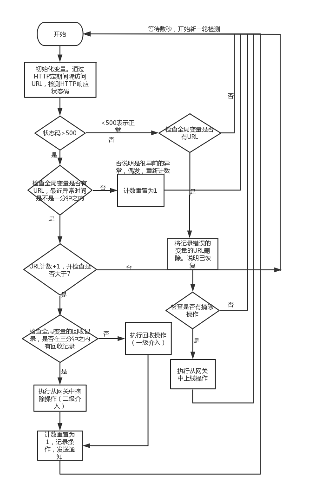

# 监控站点

 基于`Ansible`实现尝试自动修复。
 
 如果一分钟之内检测的站点后端`HTTP`响应状态码为`5XX`，并达到7次。首次将通过`Ansible`执行回收操作。
 如果回收过后，三分钟之内仍然不见效。将执行从`NGINX`中摘除操作
 

## 工作流程图


## 部署

### 准备配置文件

config.yml

```yaml
sites:
  # 监控的站点名称，该域名会在HTTP检测时，将Host设置为该域名
  test.aaa.com:
    # 定义了那些主机运行了该服务，最终的HTTP探测目标
    servers:
    - 127.0.0.1:8080
    gateway_type: nginx

  test.bbb.com:
    servers:
      - 127.0.0.1:8080
    gateway_type: nginx

# 网关服务器，当前仅支持NGINX
nginxs:
  - 128.0.255.10
  - 128.0.100.170

# 异常通知，如果填三个，将发三种消息
notify:
  # 微信
  wechat:
    corpid: wechat-corpid
    secret: wechat-secret
    users:
      - user1
      - user2

  # 邮件
  email:
    server: smtp.domain.com
    username: username
    password: password
    users:
      - username@domain.com
      - user2@domain.com

  # 钉钉
  dingding:
    # 钉钉机器人的URL，可以在讨论组中设置和查看
    robot_token: token
```

### 编译镜像

```bash
cd ProjectDir
docker build -t monitor .
```

###  docker-compose.yml
```yaml
monitor:
    image: monitor
    container_name: monitor
    net: host
    restart: always
    volumes:
      - ./ansible_hosts:/etc/ansible/hosts
      - ./hosts:/etc/hosts
      - ./config.yml:/opt/app/config.yml
```